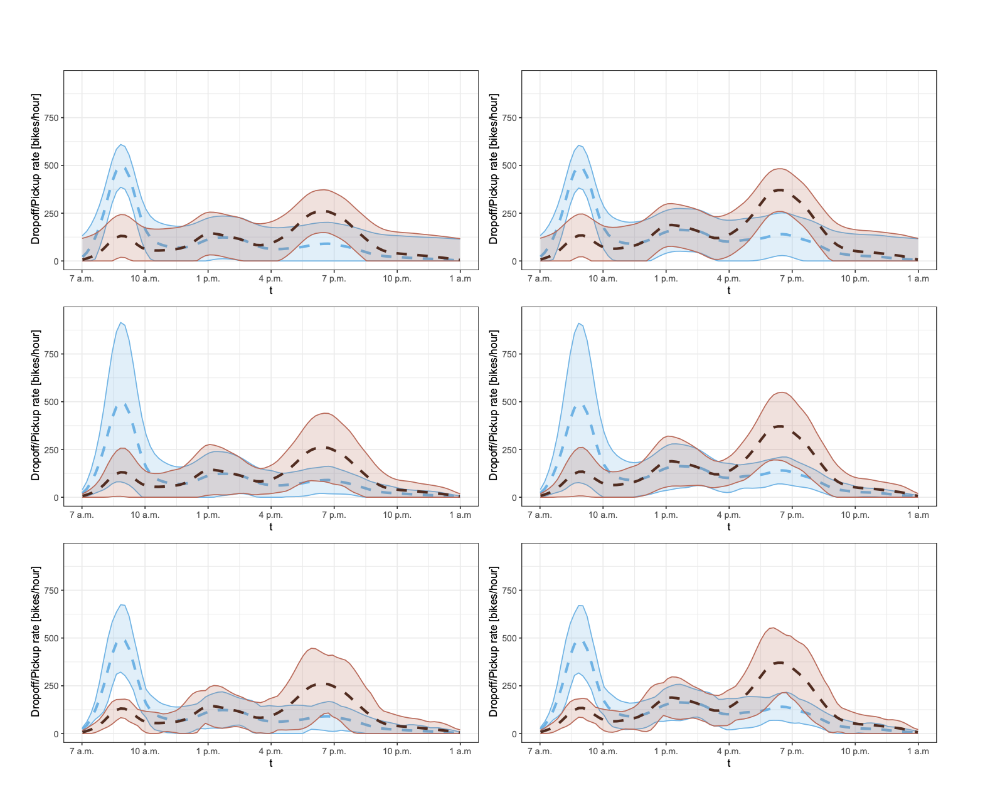

# Conformal Inference Prediction Regions for Multiple Functional Response Regression

  

   

This repository hosts the R package [conformalInference.fd](https://cran.r-project.org/web/packages/conformalInference.fd/index.html) (now available on CRAN), a powerful tool for generating valid prediction regions at levels 1-α or 1-2α, specifically designed for multiple functional response regression.

Unlike traditional methods, conformalInference.fd offers a non-parametric approach that embraces the complexity of functional data. It allows you to perform regression analysis without assuming any specific parametric form for the underlying data distribution. This flexibility enables accurate predictions and insights in a wide range of real-world applications.

Developed as part of my MSc. final thesis in Mathematical Engineering at Politecnico di Milano, conformalInference.fd extends the core methods of Conformal Prediction for regression in the univariate response case to handle the unique challenges posed by multiple functional response data.

## Code Structure

The package is organized into three main families of functions, providing a comprehensive framework for efficient and flexible functional response regression analysis:

1. Prediction methods: These functions compute prediction regions, empowering you to make accurate predictions with confidence.
2. Regression methods: This family of functions allows for the incorporation of custom-coded regression algorithms, providing users with flexibility in choosing the most suitable method for their prediction tasks. Additionally, the package includes the implementation of common regression methods.
3. Plot methods: Visualize and interpret the output of prediction methods using the plot functions provided in this package.

By separating the regression methods from the prediction methods, conformalInference.fd offers users the freedom to tailor their regression analysis to their specific needs, ensuring ultimate flexibility and customization.

## Main Functions

| Syntax                    | Description                                 |
| ------------------------- | ------------------------------------------- |
| concurrent                | Build concurrent regression models           |
| conformal.fun.jackplus    | Computes Jackknife+ prediction sets          |
| conformal.fun.split       | Computes Split Conformal prediction sets     |
| conformal.fun.msplit      | Computes Multi Split Conformal prediction sets|
| mean_lists                | Build regression methods with mean           |
| plot_fun                  | Plot the output of prediction methods        |

## Detailed Description

For a comprehensive understanding of the theoretical foundations, detailed analysis of the main functions, and case studies, please refer to my final MSc. thesis paper. The paper provides valuable insights, practical guidance, and in-depth exploration of the conformalInference.fd package. You can access the paper at the following [link](https://arxiv.org/abs/2106.01792).

## Acknowledgments

I would like to express my sincere gratitude to the following individuals for their invaluable contributions and unwavering support throughout the development of this project:

- **Prof. Simone Vantini** - _Politecnico di Milano_
- **Dr. Jacopo Diquigiovanni** - _Research collaborator_
- **Dr. Matteo Fontana** - _Research collaborator_
- **Prof. Aldo Solari** - _Università Bicocca di Milano_

Their knowledge, expertise, and encouragement have been instrumental in shaping and refining the conformalInference.fd package, making it an exceptional tool for regression analysis with multiple functional response data.

Explore the conformalInference.fd package and experience the power of accurate and versatile regression analysis in the realm of complex functional data. Unleash the full potential of your data and gain robust insights
